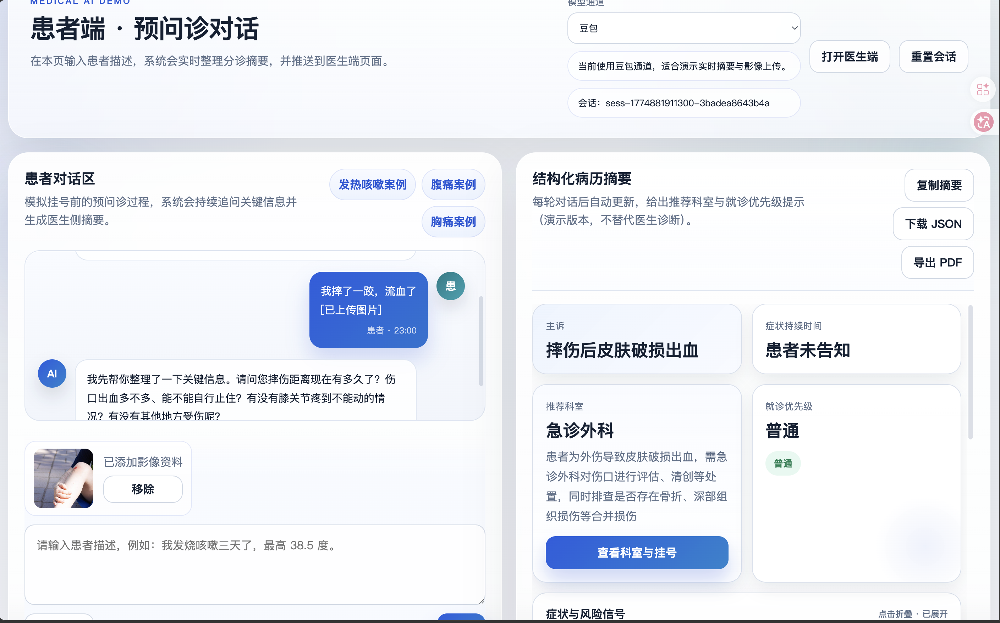
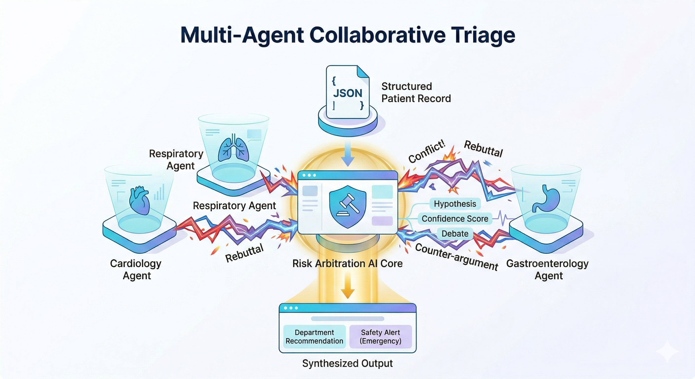
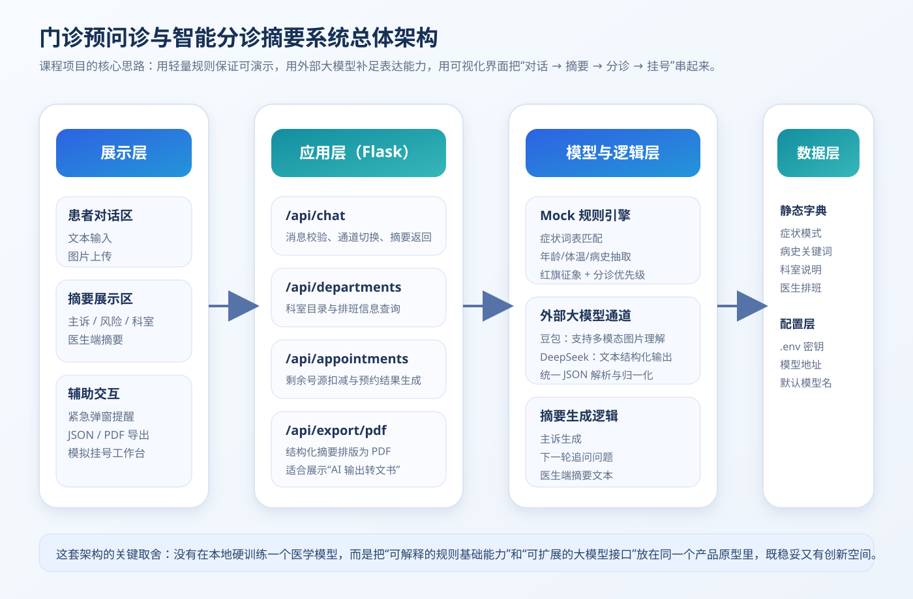

# Pre-Consult AI

## Live Demo

- Combined showcase: https://pre-consult-ai.onrender.com/combined
- Patient interface: https://pre-consult-ai.onrender.com/patient
- Doctor interface: https://pre-consult-ai.onrender.com/doctor

*An AI-assisted pre-triage and medical summary system for outpatient intake.*

Pre-Consult AI is a portfolio-grade upgrade of a medical AI course project. It transforms free-form patient conversations into a structured pre-consult summary, highlights red-flag symptoms, recommends a department, simulates appointment booking, and streams the result to a doctor-facing view in real time.

> **Positioning:** this project is designed as an *AI application / full-stack portfolio project*, not just a classroom demo.

## What problem it solves

In real outpatient settings, patients often describe symptoms in fragmented, colloquial language, while clinicians need a concise, structured summary before the visit begins. Pre-Consult AI focuses on the handoff layer between patient expression and clinical intake.

The system is built to:
- collect symptom narratives through natural conversation,
- extract a structured triage summary,
- identify urgent red flags,
- recommend a likely department and urgency level,
- provide a doctor-side preview before the patient arrives.

## Core features

- **Patient-side chat intake** with multi-turn questioning
- **Doctor-side live dashboard** for same-session summary viewing
- **Real-time SSE sync** between patient and doctor interfaces
- **Structured summary extraction**
  - chief complaint
  - duration
  - accompanying symptoms
  - past history / allergy history / medication history
  - consistency alerts
  - image findings placeholder
- **Red-flag detection and urgency escalation**
- **Department recommendation** with rationale and department profile
- **Mock rule engine + model provider mode**
  - Mock (offline demo)
  - Doubao
  - DeepSeek
- **Simulated appointment booking** with doctor schedule and remaining slots
- **PDF export** for offline handoff / printing
- **Pytest coverage** for key API routes

## Demo routes

After local startup:

- `http://127.0.0.1:5001/patient` — patient interface
- `http://127.0.0.1:5001/doctor` — doctor interface
- `http://127.0.0.1:5001/combined` — combined showcase view

## Screenshots

### Patient interface


### Doctor interface


### Architecture


## Architecture highlights
- **Flask backend** exposing triage, department, appointment, export, and session streaming APIs
- **Vanilla JS frontend** for chat flow, doctor view, and real-time status updates
- **Rule-based triage pipeline** for offline demonstration and safety-oriented defaults
- **Provider abstraction layer** for switching between model channels
- **SSE-based synchronization** for real-time doctor-side updates
- **In-memory schedule/session store** suitable for demo and portfolio use

## Local development

### 1) Create environment and install dependencies

```bash
python3 -m venv .venv
source .venv/bin/activate
pip install -r requirements.txt
```

### 2) Configure environment variables

```bash
cp .env.example .env
```

If you only want the offline demo, you can leave API keys empty and use **Mock** mode in the UI.

### 3) Run the app

```bash
python app.py
```

Open:

```text
http://127.0.0.1:5001
```

## Testing

```bash
python -m pytest -q
```

## Deployment

The recommended deployment path for this project is:

- **Dockerized deployment**
- **Render Web Service**

Why this is the best default for a portfolio project:
- closer to real production practice than raw `python app.py`
- environment consistency across local / cloud
- easier migration later to Railway / Fly.io / ECS / Kubernetes
- avoids platform Python runtime drift
- shows containerization awareness on your resume

### Production stack used here
- `Dockerfile` for build/runtime consistency
- `gunicorn` as WSGI process manager
- `render.yaml` for deployment configuration
- `docker-compose.yml` for local container testing

### Recommended public demo mode
For a public portfolio demo:
- default to **Mock mode** in the UI
- keep paid API keys only in Render environment variables

### Render deployment steps
1. Push this repository to GitHub.
2. Go to Render and create a new **Web Service** from the repo.
3. Render will detect `render.yaml` and the `Dockerfile`.
4. Add environment variables in Render:
   - `DOUBAO_API_KEY` (optional if public demo uses Mock mode)
   - `DEEPSEEK_API_KEY` (optional)
   - `DOUBAO_BASE_URL`
   - `DOUBAO_MODEL`
   - `DEEPSEEK_BASE_URL`
   - `DEEPSEEK_MODEL`
5. Deploy.
6. After deployment, open:
   - `/patient`
   - `/doctor`
   - `/combined`

### Local Docker run

```bash
docker compose up --build
```

Then open:

```text
http://127.0.0.1:5001
```

### Render runtime behavior
The container starts with:

```bash
gunicorn --bind 0.0.0.0:${PORT:-5001} app:app
```

So it is compatible with Render's injected `PORT`.

## API overview

### `POST /api/chat`
Input patient conversation and receive:
- assistant reply
- structured triage summary
- selected provider metadata
- session id for synchronization

### `GET /api/sessions/<session_id>/stream`
Server-Sent Events stream for doctor-side real-time updates.

### `GET /api/departments`
List available departments.

### `GET /api/departments/<department>/doctors`
List doctor schedule for a department.

### `POST /api/appointments`
Simulate booking a doctor slot.

### `POST /api/export/pdf`
Export the structured summary as a PDF handoff form.

## Safety notice

This project is a **demo / prototype** for pre-consult workflow support.
It is **not** a medical diagnosis system, and must not be used as the sole basis for emergency or treatment decisions.

## Repository

GitHub: https://github.com/wys917/pre-consult-ai
