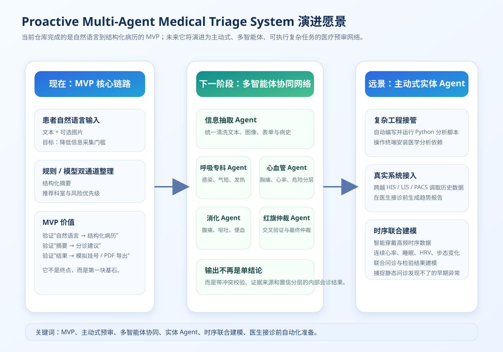
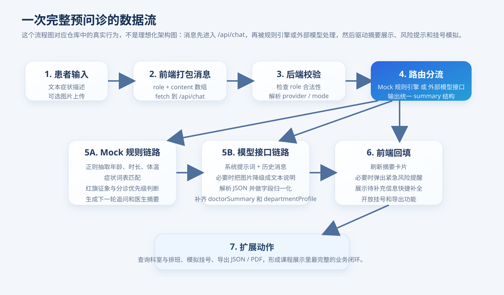
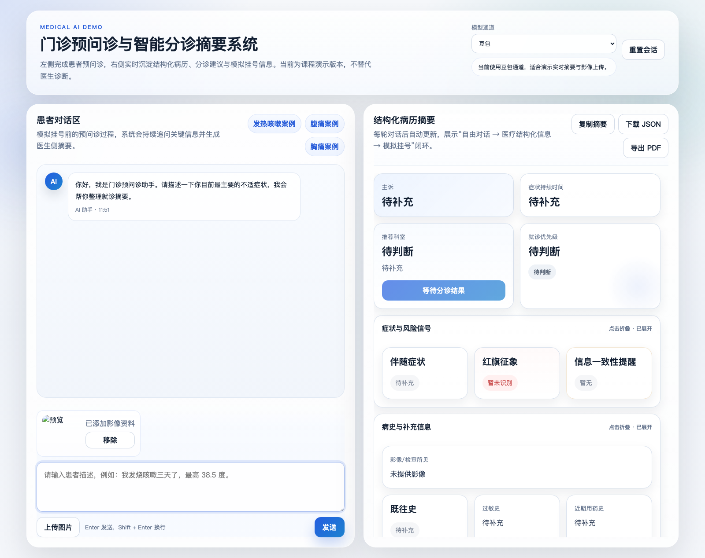
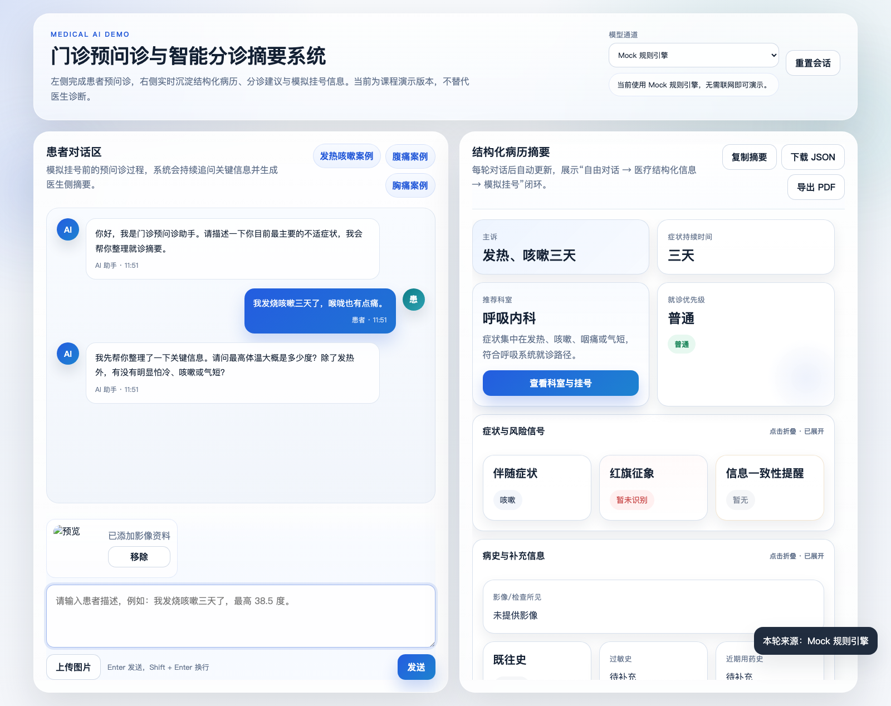
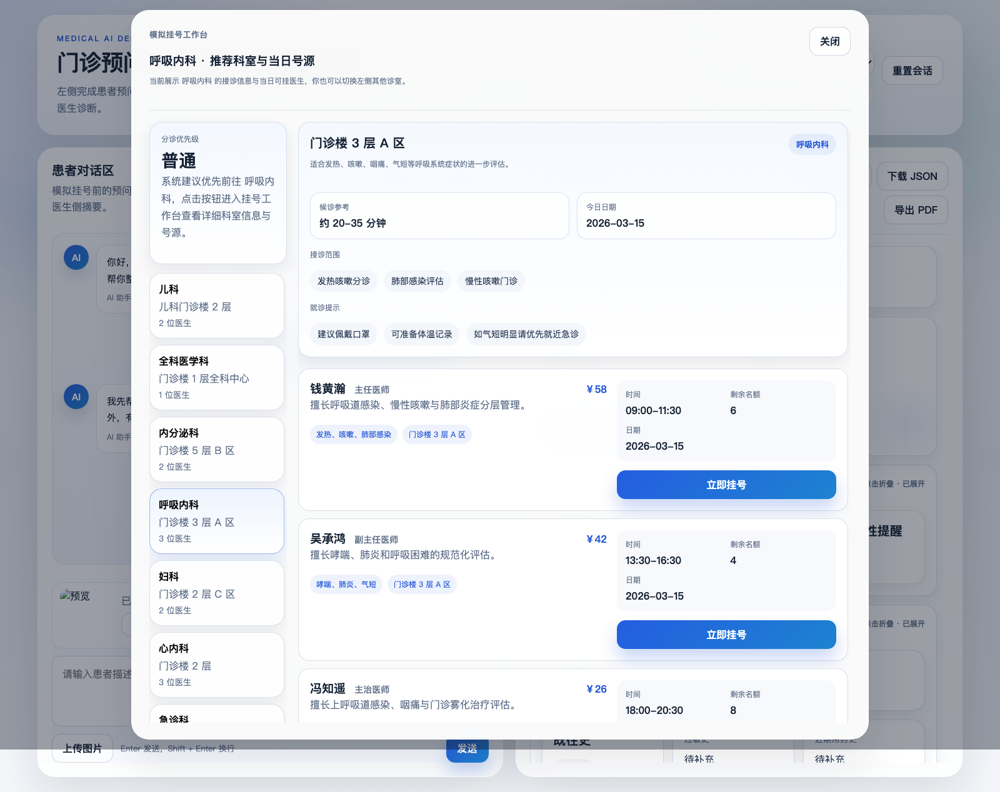

# 《医学人工智能系统设计》课程项目设计说明

## 0. 总述

这份设计说明对应的不是一个假想方案，而是我们已经完成并跑通的项目成果。不过，如果只把它描述成“一个能问症状、出摘要、推荐科室的 Web Demo”，其实低估了我们真正想做的事情。更准确的定义应该是：**“主动式多智能体医疗预审系统（Proactive Multi-Agent Medical Triage System）”的第一阶段雏形。**

在这个定义下，当前版本并不是终局，而是一个明确的 MVP。它首先验证的是最关键、也最难跳过的一段核心链路：**自然语言输入能否稳定沉淀为结构化病历摘要，并进一步转化为分诊建议、风险提醒和接诊前资料。** 这一步之所以重要，是因为未来不管系统演化成多智能体协同网络、接入时序生理数据，还是变成能直接操作临床软件环境的实体 Agent，都必须先拥有这条“从混乱输入到结构化医疗表示”的基础能力。

因此，我们更愿意把当前系统理解为一个“智能预审内核”的起点。它已经不只是一个问诊对话框，而是在门诊前置流程中承担起了信息整理、风险初筛、流程衔接和结果组织的角色；而在更长远的设想里，它会进化为一个能够主动调度多类智能体、接管复杂临床工程任务、并在医生接诊前完成大量准备工作的医疗 AI 基础设施。

---

## 1. 选题背景与需求分析

医学人工智能这几年发展很快，但真正能落地的系统往往不是“模型精度越高越好”这么简单。医疗场景里更常见的问题是流程断裂：患者描述很口语化，前台分诊信息很零散，医生接诊前拿到的信息往往不完整。尤其在门诊初筛阶段，如果能先把患者描述转换成结构化摘要，再提示是否存在危险信号、建议挂哪个科，整个流程就会顺很多。

在开发这个项目时，我们一开始就没有把目标设成“替代医生”，而是把它定位为一个“**可解释、可演示、可扩展**”的课程项目。README 中也明确写了系统是“门诊预问诊与智能分诊摘要 Demo”，而代码实现同样遵循这一定位，主要围绕以下几个核心需求展开：

1. 让患者用自然语言说出不适，而不是填写生硬表单。
2. 自动把口语描述整理成医生更容易看的结构化信息。
3. 识别胸痛、呼吸困难、高热、意识异常等风险信号。
4. 给出推荐科室和就诊优先级，而不是直接下诊断。
5. 把结果延伸到导出摘要、模拟挂号、接诊前预览。

但如果站在课程设计的学术想象力上，这个问题还可以再往前推一步。我们真正感兴趣的，并不是“怎样做一个更像客服机器人的问诊框”，而是“能否设计出一套在医生正式接诊之前，就开始主动工作、主动调度、主动收集证据的智能预审系统”。换句话说，未来的医疗 AI 不应该只是等待患者说话，而应该像一个接诊前的数字化团队那样，自主整合问诊文本、历史记录、检验资料、设备数据和风险线索，为医生提前准备一份更接近临床实际的预审结果。

---

## 2. 相关研究与我们这次的取舍

传统医学人工智能研究通常聚焦于三类任务。第一类是医学影像识别，比如用 CNN 做皮肤病灶分类、胸片异常识别；第二类是临床文本处理，比如电子病历抽取、诊断编码推荐；第三类是基于时序数据的预测任务，例如 ICU 风险预警、生命体征趋势分析。Transformer 和大语言模型出现之后，医学 AI 又多了一个很重要的方向：让模型理解更长的医疗文本，甚至把图像、文本和结构化数据联合起来处理。

在具体实现上，我们并没有选择自己从零训练一个 CNN、Transformer 或时序模型。相反，我们采用了一条更符合我们三人团队能力边界、也更适合课程原型验证的技术路线：**基础能力用本地规则保证稳定，复杂表达交给外部大模型通道。**

相关文献中，Esteva 等人证明了深度神经网络在皮肤病图像分类上的潜力[1]；Rajpurkar 等人的 CheXNet 展示了深度学习在胸片分析上的能力[2]；Vaswani 等人的 Transformer 架构则为今天的大模型和多模态系统打下了基础[3]。这些研究更偏底层模型能力，而本项目更像是站在这些通用能力之上，去做一个医疗场景下的前端系统整合与流程设计。

从更前沿的视角看，我们当前的工作还可以与三个方向接轨。第一，是面向复杂环境执行的实体 Agent 系统，即让模型不仅“会判断”，还“会做事”；第二，是时序生理数据与文本病历的联合建模，突破静态问诊切面的限制；第三，是多智能体协同网络，让不同专科智能体在后台像一个小型会诊团队那样交叉验证。当前仓库还没有把这些方向全部实现出来，但我们希望在课程报告中明确表达：这正是系统下一步演化的理论坐标。

---

## 3. 系统整体设计

先放一张我们根据自己实现的代码整理出来的总体架构图：

从实际实现看，系统可以拆成四层。

**第一层是展示层。** 对应 `templates/index.html` 和 `static/app.js`。页面采用左右双栏布局：左边是患者对话区，右边是结构化摘要区。顶部可以切换模型通道，底部支持输入文本、上传图片。右侧除了主诉、伴随症状、红旗征象外，还加入了医生端摘要、信息一致性提醒、PDF 导出和模拟挂号。

**第二层是应用层。** 后端基于 Flask 实现，核心接口包括 `/api/chat`、`/api/departments`、`/api/departments/<department>/doctors`、`/api/appointments` 和 `/api/export/pdf`。这一层负责消息校验、模型通道选择、摘要回填、排班查询和导出响应。我们也专门为这些接口补了自动化测试。

**第三层是模型与逻辑层。** `app.py` 中既有基于正则和词典的规则分析链路，也有面向豆包和 DeepSeek 的统一模型调用链路。规则链路负责抽取年龄、持续时间、体温、既往史、过敏史、用药史，并识别胸痛伴呼吸困难、右下腹痛、高热等红旗征象。模型链路则通过系统提示词要求大模型严格输出 JSON，再经过后端做字段归一化。

**第四层是数据与配置层。** 当前版本没有接数据库，主要用 Python 字典维护症状词表、病史关键词、科室说明和医生排班，这也符合我们在课程周期内先完成原型闭环的开发节奏。模型 API 的密钥、地址和模型名通过 `.env` 管理，静态排班信息则直接保存在内存中。

### 3.1 演进蓝图

如果只停留在当前四层架构，这个系统依然可以被理解为一个“做得比较完整的智能问诊前端”。但我们真正想表达的是：这四层只是第一阶段。它们更像是未来大系统里的“底座”，尤其是结构化摘要、风险抽取和统一接口这几个部分，会成为后续多智能体协作的共享中间表示。

下面这张图展示的是我们设想中的中长期演进方向：

在这个演进蓝图中，系统会经历三个阶段。第一阶段，就是我们已经完成的 MVP，它解决自然语言问诊到结构化病历的核心转换问题。第二阶段，系统后台将从“单一规则/模型链路”演化为“多智能体协同网络”，至少包括信息抽取 Agent、各专科 Agent 和红旗风险仲裁 Agent。不同 Agent 不再只是串行调用，而是围绕同一份病例草案给出各自视角的判断，再通过仲裁机制形成一致性更高的预审意见。第三阶段，则是“主动式实体 Agent”阶段。届时，系统不只是被动回应患者，而是可以在真实或沙盒环境中主动执行任务，例如自主编写并运行 Python 数据分析脚本，跨系统调取历史检查结果，甚至在终端中自动安装并运行必要的医学分析依赖，提前为医生生成趋势报告和风险摘要。

换句话说，当前版本的创新不应该被理解为“我们做了一个网页”，而应该被理解为“我们已经把未来主动式医疗预审系统中最核心的中间层做出了第一版”。

---

## 4. 数据流

下面这张图对应一次真实调用路径：

结合我们已经跑通的系统流程，数据流基本是这样的。

患者先在左侧输入症状，比如“我发烧咳嗽三天了，喉咙也有点痛”。前端把消息保存为 `messages` 数组，再通过 `fetch('/api/chat')` 发给后端。如果上传了图片，前端会把图片转成 Base64 一起发过去。后端收到消息后先执行 `validate_messages`，检查每条消息的 `role` 是否合法、`content` 是否为空，再根据 `provider` 选择通道。

如果选择 `mock`，后端会调用 `analyze_conversation`。在这条链路里，系统会依次做文本归一化、年龄抽取、时长抽取、体温抽取、症状识别、红旗征象检测、优先级判断、推荐科室、缺失信息生成、下一轮追问生成和医生端摘要生成。如果选择 `doubao` 或 `deepseek`，则会把消息和系统提示词一起送到模型接口，请模型直接返回 JSON，再通过 `normalize_model_summary` 把字段整理成统一格式。

最后，前端拿到 `summary` 后会实时刷新右侧所有摘要卡片。如果优先级是“紧急”，界面会弹出警示框；如果推荐科室已经明确，就可以点击“查看科室与挂号”，进入模拟挂号工作台，继续调用排班和预约接口。也就是说，当前 MVP 已经把“问诊文本、结构化摘要、风险提醒和流程动作”串成了闭环，这正是未来引入更多 Agent 之前最需要被验证的基础。

---

## 5. 核心模块设计

### 5.1 数据处理与特征抽取模块

这个模块主要在 `app.py` 的中段。系统通过一组正则函数抽取年龄、持续时间和体温，通过 `SYMPTOM_PATTERNS` 词表识别发热、咳嗽、咽痛、腹痛、胸痛、呼吸困难等症状，再通过 `HISTORY_KEYWORDS` 提取高血压、糖尿病、冠心病等既往史。

### 5.2 风险评估与分诊模块

在 `detect_red_flags` 和 `recommend_department` 中，系统把一些明显危险组合单独拉出来，例如“胸痛 + 呼吸困难”直接升级为紧急，“高热”“黑便/便血”“右下腹痛”会提升优先级或改变科室推荐。

### 5.3 模型接入与摘要归一化模块

这部分主要是 `call_model_api`、`adapt_messages_for_provider` 和 `normalize_model_summary`。项目支持豆包和 DeepSeek 两个通道，还考虑了一个很实际的问题：并不是所有模型都能直接看图，所以如果当前通道不支持多模态，就把图片信息退化成文本提醒。模型返回结果后，后端不会直接信任，而是统一补字段、校正列表类型、限制 `triagePriority` 只能取固定值。

如果放到未来的多智能体框架里看，这个模块其实就是一个 Agent 适配层的前身。今天它适配的是不同模型通道，明天它就可以进一步扩展为不同智能体之间的通信总线，让呼吸专科 Agent、心血管 Agent、时序分析 Agent 都围绕统一的病例表示进行协作。

### 5.4 挂号与排班模块

系统不是停在推荐“去呼吸内科”这种静态文本，而是进一步维护了多个科室的简介、位置、接诊范围、提示信息和医生排班。`/api/appointments` 甚至会在预约成功后扣减剩余号源。

### 5.5 导出与文档模块

通过 `ReportLab`，系统可以把当前摘要导出成 PDF 预问诊单。这一功能在真实产品里其实也很重要，因为 AI 结果只有转成可流转、可打印、可交接的文档，才真正接近医疗工作流。对我们这个项目来说，这一步也体现了一个比较重要的设计意识：不要只展示“模型会说话”，要展示“模型的输出怎样进入业务”。

---

## 6. UI 设计

先放运行截图。下面这张是首页和完成一次问诊后的主界面：

可以看出，UI 的重点不是装饰，而是信息组织。左侧对话区负责降低输入门槛，右侧摘要区负责提高阅读效率。特别是“仍待补充信息”下面做了快捷补全按钮，这个设计很像把医生追问模板嵌到了前端里，能让下一轮输入更有方向。

下面这张是挂号工作台截图：

推荐科室之后，患者到底去哪、有哪些医生、剩余名额是多少、挂号结果怎样，系统都给了一个模拟答案，在真实环境中可以继续优化。

从更长远的角度看，这个界面未来也不一定只承担“展示”功能。随着系统演化为主动式 Agent 网络，前端还可能成为一个“可审阅的智能工作台”，不仅显示问诊摘要，还展示不同专科 Agent 的判断依据、冲突意见、时序趋势分析曲线，以及实体 Agent 已经自动完成了哪些准备工作。

---

## 7. 软件接口设计

系统核心接口是 `/api/chat`。输入是 `messages` 数组和 `provider`，输出是统一的 `summary`。`summary` 里固定包含 `chiefComplaint`、`duration`、`accompanyingSymptoms`、`redFlags`、`recommendedDepartment`、`departmentReason`、`triagePriority`、`missingInformation`、`doctorSummary`、`pastHistory`、`allergyHistory`、`medicationHistory`、`consistencyAlerts` 和 `imageFindings` 等字段。

辅助接口方面，`/api/departments` 负责返回科室目录；`/api/departments/<department>/doctors` 返回某科室的排班与地点说明；`/api/appointments` 接收 `department`、`doctorId` 和 `patientName`，返回预约结果；`/api/export/pdf` 则接收 `summary` 并返回 PDF 字节流。因为这些接口都比较轻量，所以模块之间的通信负担不大，后续如果要换成数据库或前后端分离架构，也比较容易迁移。

---

## 8. 可行性与性能

从技术可行性看，这个项目使用的 Flask、Requests、python-dotenv、ReportLab 和 Pytest 都很成熟。更重要的是，核心规则链路几乎不依赖外部环境，即使没有模型 API，也能用 `mock` 模式跑完整演示。

从运行验证看，我们实际执行了 `python -m pytest -q`，**8 个测试全部通过**，覆盖了聊天接口、医生排班、挂号成功、字段校验和 PDF 导出。也就是说，这个项目已经不是单纯概念图，而是具备最小可用性的原型系统。

从性能角度看，本地规则模式几乎都是字符串处理和字典查找，响应很快；API 模式的瓶颈主要在外部模型推理时间和网络延迟。当前系统没有数据库，也没有复杂并发处理，所以在课程演示规模下足够轻量。未来如果要继续扩展，可以考虑把静态排班信息迁移到数据库，把摘要缓存下来，或者把图像识别拆到独立服务里。

而如果把目标放到“主动式多智能体医疗预审系统”，可行性分析就需要再向前看一步。实体 Agent 和复杂工程接管并不是今天就能无条件落地的功能，它们涉及权限管理、沙盒执行、安全审计和临床信息系统接口规范；时序联合建模也需要持续采样设备和标注数据支撑；多智能体内部会诊则需要解决冲突仲裁与责任归因问题。也正因此，我们当前选择从 MVP 起步是有意义的：先把最小闭环做稳，再把系统逐步推向更大胆的形态。

---

## 9. 项目亮点、局限与下一步能做什么

从我们自己的开发过程回头看，这个项目目前最值得总结的地方有三个。

第一，它没有把“医学 AI”狭义地理解为“训一个模型”，而是理解为“用智能能力重构一个医疗流程”。第二，它做到了真正的闭环：自由对话、结构化摘要、风险提醒、推荐科室、医生端预览、模拟挂号、PDF 导出一条线走通。第三，它用“规则引擎 + 大模型接口”的方式，把可解释性和扩展性同时保住了，这是一个非常适合学生团队的工程策略。

当然，局限也很明显。系统目前没有真实医学数据集训练和评估，不能证明临床准确率；排班和科室数据都是内存模拟；隐私保护、权限控制、日志审计这些真实医疗系统很看重的部分也还没有进入实现阶段。换句话说，它现在更像一个高完成度课程原型，而不是可直接进医院的系统。

如果继续做下去，我们会优先考虑四条路线。第一，引入真实匿名化问诊样本，对规则链路和模型链路做对比评估，把当前 MVP 从“能用”推进到“可量化评估”。第二，加入医学知识库或检索增强，让推荐理由更稳，并让不同专科 Agent 有共享知识底座。第三，把图片理解、OCR、化验单解析接进来，让“上传图片”这个入口从展示功能变成真正有用的能力。第四，也是最有想象力的一条路线，是把系统逐步推进为主动式实体 Agent：一方面可以在沙盒环境中自主编写并运行 Python 分析脚本，自动完成趋势计算和报告生成；另一方面可以探索与 HIS、LIS、PACS 等系统的接口联动，在医生接诊前主动调取历史化验单、用药记录和检验趋势。

再往后看，我们尤其希望把时序数据真正纳入系统主干。未来如果能接入智能穿戴设备的连续心率、血氧、睡眠、HRV、步态与活动强度数据，系统就不再只是根据患者此刻说出的症状进行静态判断，而是能够通过多维生理时序信号的联合建模，提前发现文本问诊里不容易暴露的早期病理变化。届时，多智能体协同网络就不仅是多个“会聊天”的 Agent，而会变成一个真正能处理文本、图像、结构化指标与连续生理时间序列的医疗预审生态。

---

## 10. 参考文献

[1] Esteva A, Kuprel B, Novoa R A, et al. Dermatologist-level classification of skin cancer with deep neural networks. Nature. 2017.  
[2] Rajpurkar P, Irvin J, Zhu K, et al. CheXNet: Radiologist-Level Pneumonia Detection on Chest X-Rays with Deep Learning. arXiv. 2017.  
[3] Vaswani A, Shazeer N, Parmar N, et al. Attention Is All You Need. arXiv. 2017.  
[4] Topol E J. High-performance medicine: the convergence of human and artificial intelligence. Nature Medicine. 2019.  
[5] Barragán-Montero A, Javaid U, Valdés G, et al. Artificial intelligence and machine learning for medical imaging: A technology review. Physica Medica. 2021.  

---

## 11. 成员分工

**苏易文：**搭建并完成项目，编写设计报告初稿

**张崇洋：**

**廖晨皓：**

---
